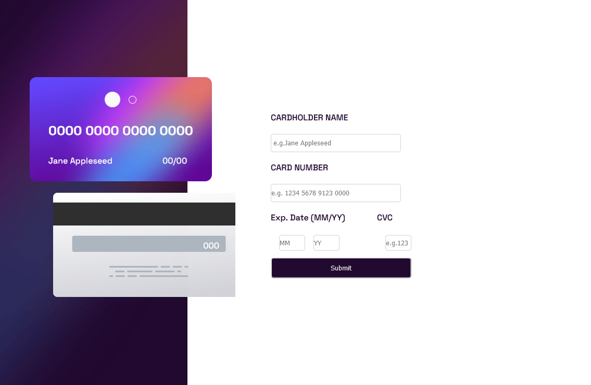

# Frontend Mentor - Interactive card details form solution

This is a solution to the [Interactive card details form challenge on Frontend Mentor](https://www.frontendmentor.io/challenges/interactive-card-details-form-XpS8cKZDWw). Frontend Mentor challenges help you improve your coding skills by building realistic projects.

## Table of contents

- [Overview](#overview)
  - [The challenge](#the-challenge)
  - [Screenshot](#screenshot)
- [My process](#my-process)
  - [Built with](#built-with)
  - [What I learned](#what-i-learned)
  - [Continued development](#continued-development)
- [Author](#author)

**Note: Delete this note and update the table of contents based on what sections you keep.**

## Overview

### The challenge

Users should be able to:

- Fill in the form and see the card details update in real-time
- Receive error messages when the form is submitted if:
  - Any input field is empty
  - The card number, expiry date, or CVC fields are in the wrong format
- View the optimal layout depending on their device's screen size
- See hover, active, and focus states for interactive elements on the page

### Screenshot



This is a Screenshot of the solution that i build.There are both desktop and mobile screenshots that i ran in my devices

### Links

- Solution URL: [This is the link to the code.](https://github.com/Suleman-Tasawar/Interactive-Card)
- Live Site URL: [This is the link to the live site](https://suleman-tasawar.github.io/Interactive-Card/)

## My process
I Started it by building a Desktop First Version cause i love this approch.Then i designed the Card UI.Then i moved to the form 

### Built with

- Semantic HTML5 markup
- CSS custom properties
- Flexbox

### What I learned

I learnt many thing as working along this projects.I'ill mention a few of them

- To check the validity using html pattern
- To retrieve the input data and display it
- To show the validation error if any
- To show the next page after sucessfull validation
  To see how you can add code snippets, see below:

```html
<section class="UI">
  <div class="card__example">
    <div class="card__upper">
      <span class="circle1"></span>
      <span class="circle2"></span>
    </div>

    <div class="card__lower">
      <div class="card__num">
        <h1 class="CardNumberShow">0000 0000 0000 0000</h1>
      </div>

      <div class="card__details">
        <p class="CardNameShow">Jane Appleseed</p>

        <p class="mmyy CardMonthYearShow">00/00</p>
      </div>
    </div>
  </div>

  <div class="card__illustration">
    <p class="CardCvcShow">000</p>
  </div>
</section>
```

```css
.card__example {
  display: flex;
  flex-direction: column;
  justify-content: space-evenly;
  align-items: center;
  position: absolute;
  top: 20%;
  left: 5%;
  background-image: url("images/bg-card-front.png");
  background-size: cover;
  width: 350px;
  height: 200px;
  border-radius: 13px;
  color: #fafafa;
}
```

```js
if (card__name.checkValidity() && card__num.checkValidity() && card__month.checkValidity() && card__year.checkValidity() && card__cvc.checkValidity()) {

        let sucess = document.querySelector(".sucessfull__page");
        sucess.style.display = "block";
        let close__sucess = document.querySelector(".close__button");
        close__sucess.addEventListener("click", () => {
            sucess.style.display = "none";
        })
```
### Continued development

Note that this is'nt the finished version of the Project.I still have a few things to figure out and fix them.I will continue to update this repo.Stay tuned


## Author

- Website - [Suleman Tasawar](https://www.suleman-tasawar-portfolio.on.drv.tw/pages/)
- Frontend Mentor - [@yourusername](https://www.frontendmentor.io/profile/Suleman-Tasawar)
